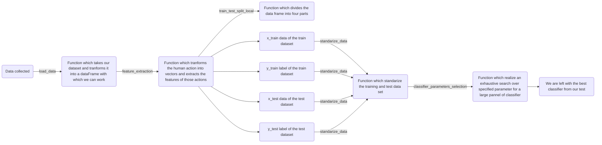

## Flowchart of our project

```mermaid
graph LR
    dataset(Data collected)--load_data-->load_data(Function which takes our dataset and tranforms it into a dataFrame with which we can work)
    load_data--feature_extraction-->feature_extraction(Function which tranforms the human action into vectors and extracts the features of those actions)
    feature_extraction--train_test_split_local-->train_test_split_local(Function which divides the data frame into four parts)
    feature_extraction-->x_train(x_train data of the train dataset) & y_train(y_train label of the train dataset) & x_test(x_test data of the test dataset) & y_test(y_test label of the test dataset)
    x_train & y_train & x_test & y_test --standarize_data-->standarize_data(Function which standarize the training and test data set)
    standarize_data--classifier_parameters_selection-->classifier_parameters_selection(Function which realize an exhaustive search over specified parameter for a large pannel of classifier)
    classifier_parameters_selection-->results(We are left with the best classifier from our test)
```
